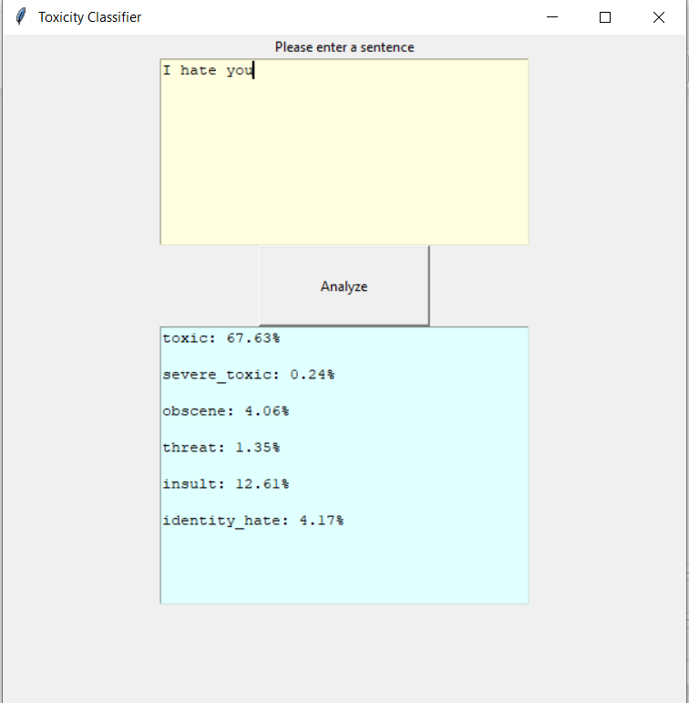

# Toxicity_Classification

This repo is about creating a simple comment toxicity classifier
(based on this tutorial [1])

### The expected output is

## The Outline
### * Collect the dataset
### * Clean and preprocess the dataset
### * Create the model
### * Train the model
### * Evaluate the model
### * Deploy the model in the app
### * Resources
